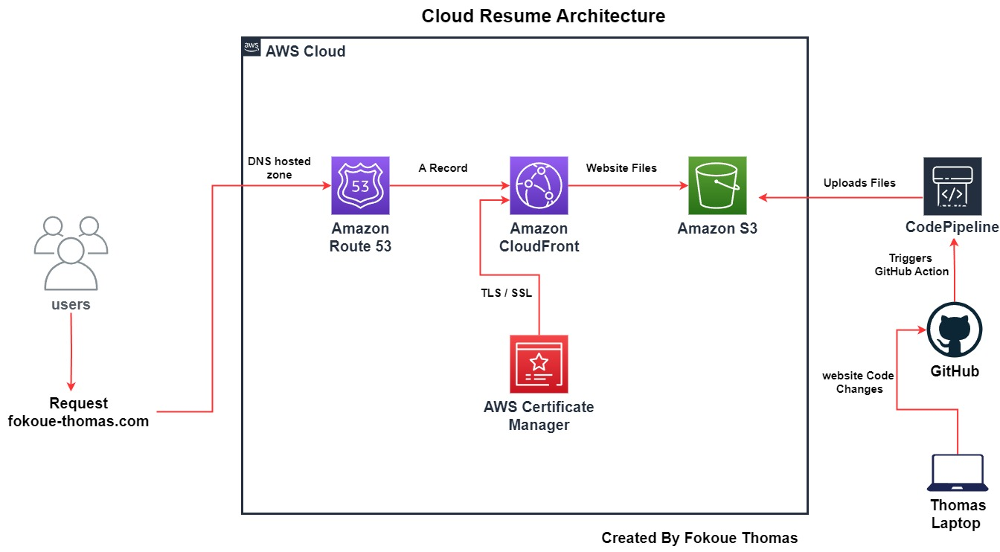
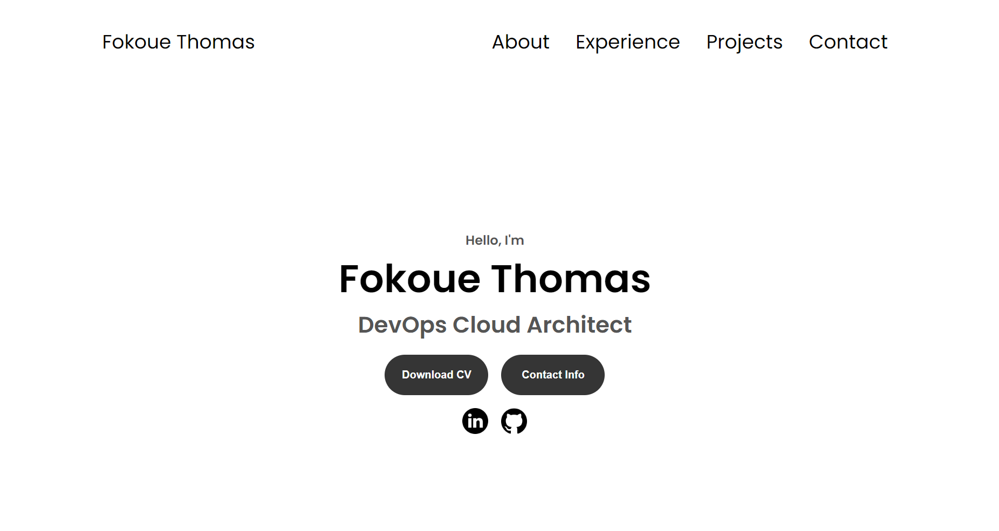
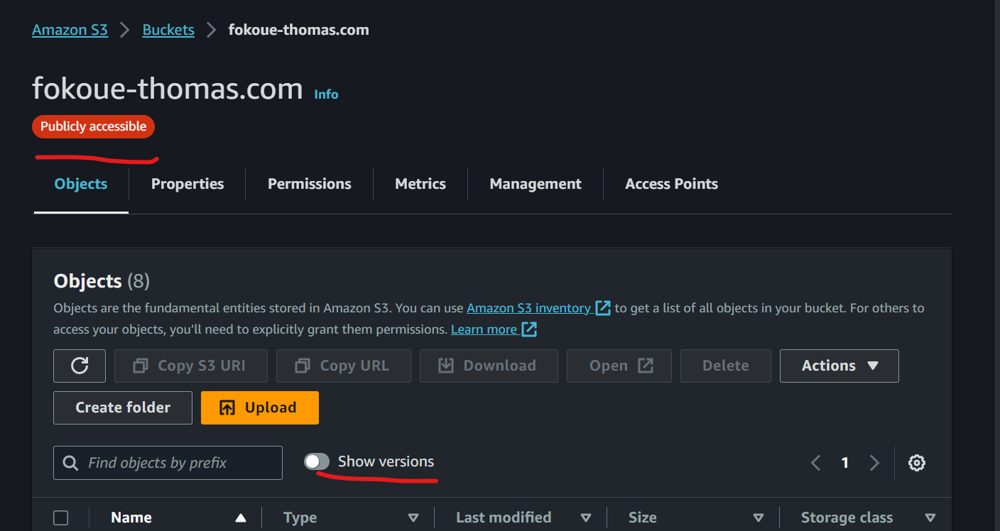
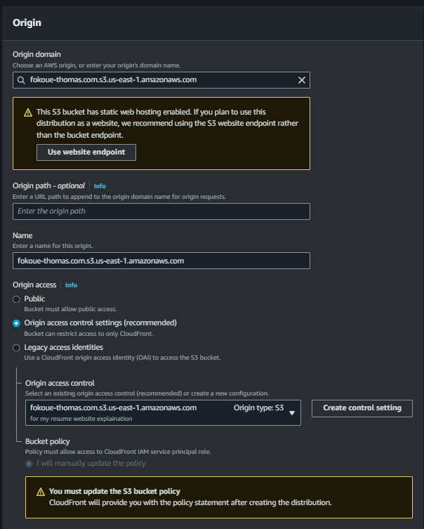
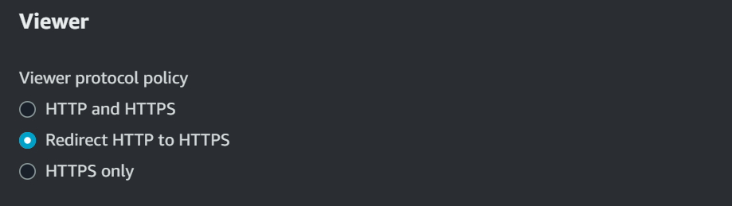
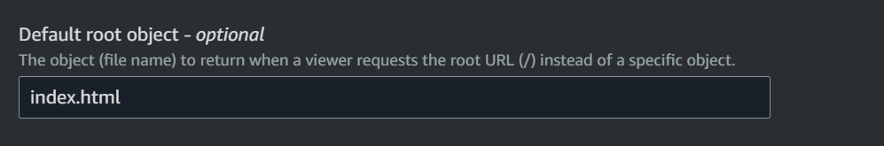

# fokoue-thomas.com-repo

## This repository contain my personal website launged using Github, S3 bucket, codePipline, Route53, cloudFrond and AWS Certificate Manager. 

## The website 

# STEPS BY STEPS PROCESS 

## `Step 1:` Storing Your Website’s HTML Files with S3

To begin, we utilize `Amazon S3 (Simple Storage Service)` as a storage solution for our website’s `HTML, CSS, and JavaScript files`. S3 offers highly durable and scalable object storage, making it an ideal choice for hosting static content. By creating an S3 bucket, you can securely store and manage your website’s files. 

### * Start by creating a new bucket, and picking a unique Name and Region that suits you.
### * Ensure that ACLs remain disabled, and be certain to enable the “Block all public access” setting to prevent any unauthorized public access to the contents stored in the bucket.

## `Step 3:` Setting Up CloudFront 

While S3 provides reliable storage, we enhance the performance and global reach of our website by leveraging `CloudFront AWS’s Content Delivery Network (CDN)`. CloudFront caches and distributes your website’s content across a network of `Edge locations worldwide`, reducing latency and improving the user experience.

### * When creating the distribution, make sure to select the S3 bucket as the `Origin Domain`, and select `Origin access control settings` under Origin Access. `OAC (Origin Access Control) in CloudFront` is a feature that allows you to restrict access to your origin server, ensuring that only specified CloudFront distributions can access it. AFTER the creation of the distribution, you will see an option to copy the S3 bucket policy that allows only CloudFront to communicate with the S3 bucket, for now do not worry about this step.

### * Change the viewer protocol to Redirect HTTP to HTTPS to ensure the secure transfer of data.

### * Also, modify the root object to “index.html,” which will be the default file served when accessing the website.

### * Click on the “Create Distribution” button and wait for approximately 5-10 minutes for CloudFront to complete the creation process. 

# fokoue-thomas.com 
Verify my resume website here [this page](https://www.fokoue-thomas.com/)