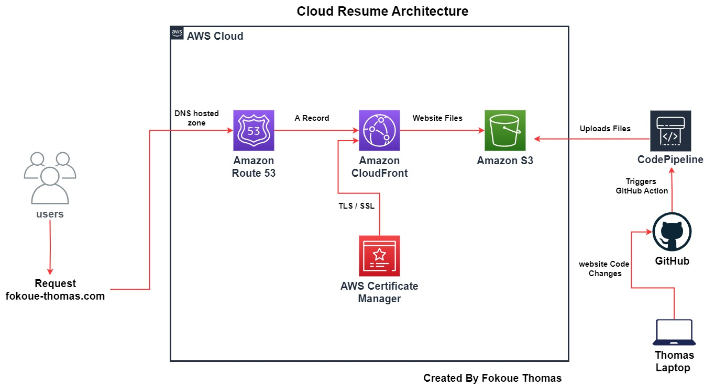
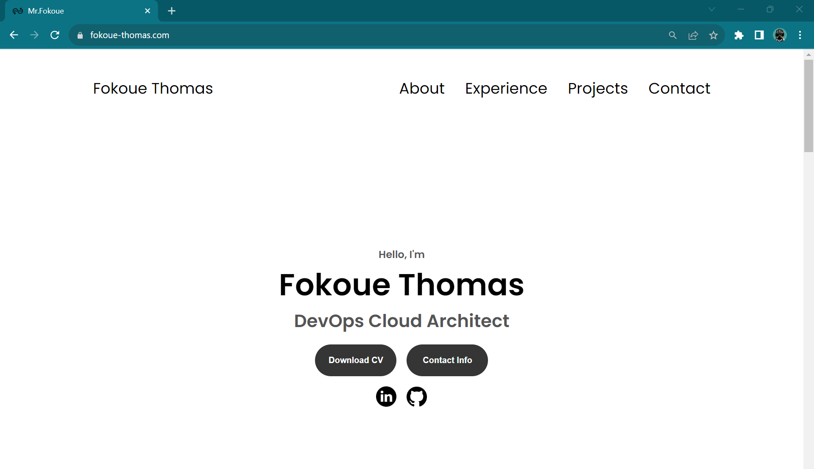
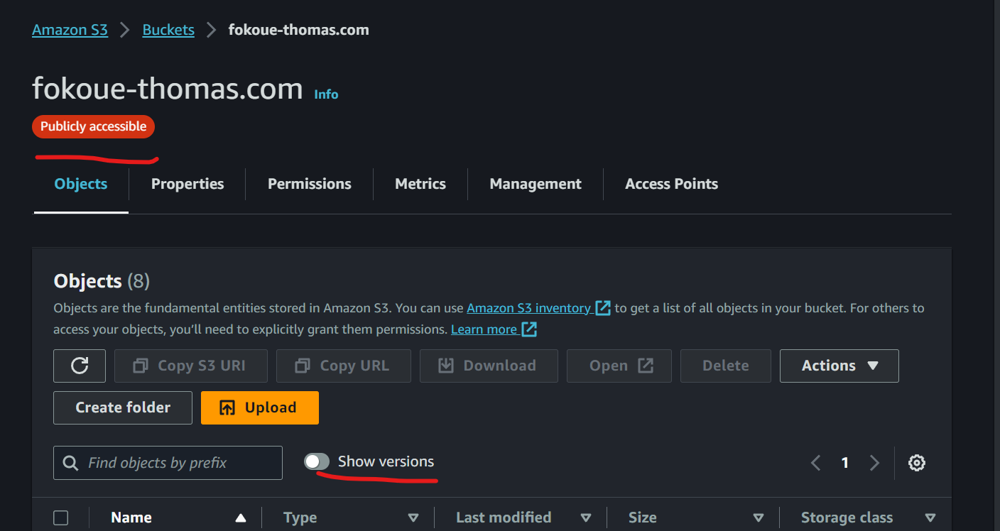
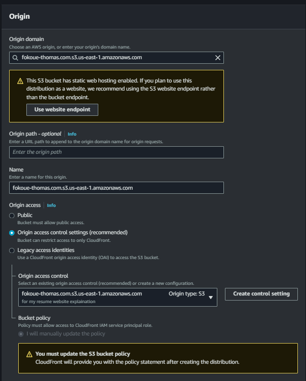
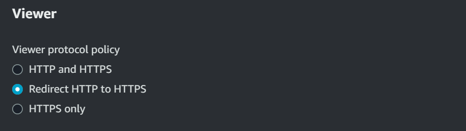
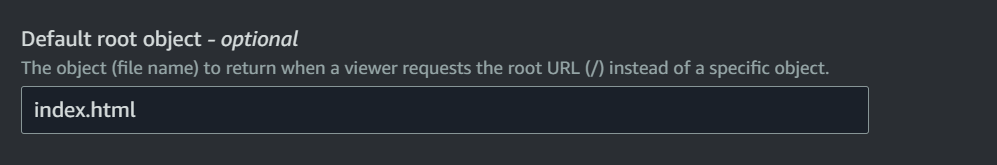
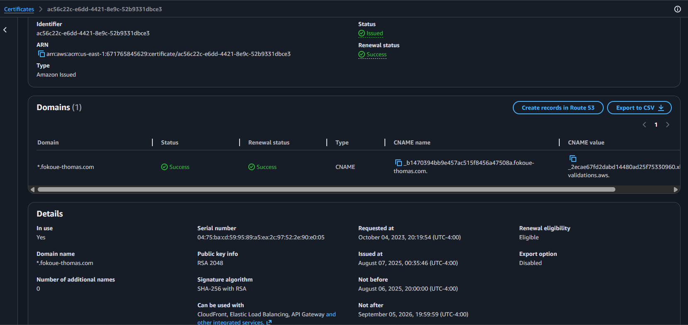
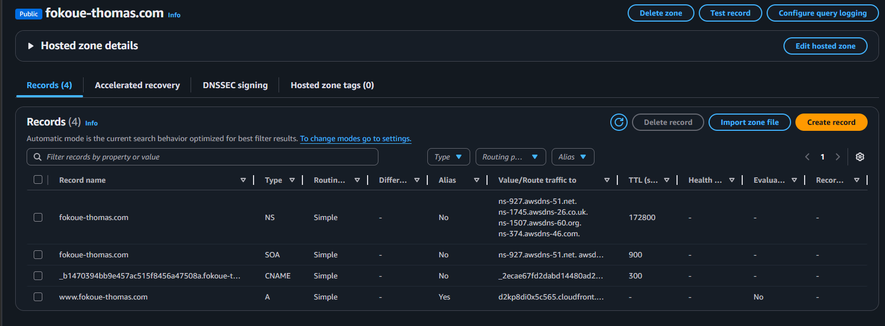
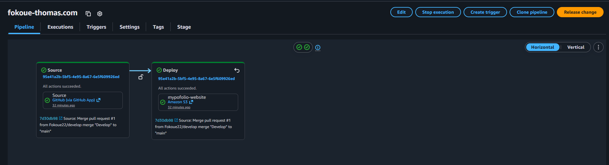

# fokoue-thomas.com-repo

## This repository contain my personal website launged using Github, S3 bucket, codePipline, Route53, cloudFrond and AWS Certificate Manager. 




## The website 




# STEPS BY STEPS PROCESS 

## `Step 1:` Storing Your Website's HTML Files with S3

To begin, we utilize `Amazon S3 (Simple Storage Service)` as a storage solution for our website's `HTML, CSS, and JavaScript files`. S3 offers highly durable and scalable object storage, making it an ideal choice for hosting static content. By creating an S3 bucket, you can securely store and manage your website's files. 

### * Start by creating a new bucket, and picking a unique Name and Region that suits you.
### * Ensure that ACLs remain disabled, and be certain to enable the "Block all public access" setting to prevent any unauthorized public access to the contents stored in the bucket.





## `Step 2:` Setting Up CloudFront 

While S3 provides reliable storage, we enhance the performance and global reach of our website by leveraging `CloudFront AWS's Content Delivery Network (CDN)`. CloudFront caches and distributes your website's content across a network of `Edge locations worldwide`, reducing latency and improving the user experience.

### * When creating the distribution, make sure to select the S3 bucket as the `Origin Domain`, and select `Origin access control settings` under Origin Access. `OAC (Origin Access Control) in CloudFront` is a feature that allows you to restrict access to your origin server, ensuring that only specified CloudFront distributions can access it. AFTER the creation of the distribution, you will see an option to copy the S3 bucket policy that allows only CloudFront to communicate with the S3 bucket, for now do not worry about this step.




### * Change the viewer protocol to Redirect HTTP to HTTPS to ensure the secure transfer of data.



### * Also, modify the root object to "index.html," which will be the default file served when accessing the website.





### * Click on the "Create Distribution" button and wait for approximately 5-10 minutes for CloudFront to complete the creation process.

### * Once CloudFront distribution is created, copy the S3 bucket policy from the CloudFront settings and apply it to your S3 bucket. This ensures that only CloudFront can access your S3 bucket, improving security by blocking direct public access.

### * **Save the CloudFront distribution domain name** (e.g., d123.cloudfront.net) - you will need this URL for the next steps.


## `Step 3:` Securing Your Website with AWS Certificate Manager

`AWS Certificate Manager (ACM)` provides free SSL/TLS certificates to secure your website with HTTPS encryption. This protects data transmitted between users and your website, building trust and improving SEO rankings.

### * Request a new public certificate in AWS Certificate Manager for your domain (e.g., fokoue-thomas.com and www.fokoue-thomas.com).
### * AWS will provide **CNAME records** for DNS validation - copy these CNAME records (name and value).
### * Do NOT validate yet - you will add these CNAME records to Route53 in the next step.
### * Once Route53 records are added and validated, associate the certificate with your CloudFront distribution by updating the distribution settings to add your domain name in Alternative Domain Names (CNAMEs).

The certificate is automatically renewed by AWS, so you don't need to manage certificate expiration manually.




## `Step 4:` Configuring DNS with Route53

`Amazon Route53` is a highly available and scalable Domain Name System (DNS) web service that connects user requests to your website hosted in AWS. By creating DNS records, you can map your custom domain name to your CloudFront distribution with HTTPS encryption.

### * Create a hosted zone in Route53 for your domain (e.g., fokoue-thomas.com).
### * Add an **A record (alias)** that points to your CloudFront distribution domain name (the URL you saved in Step 2, e.g., d123.cloudfront.net).
### * Add the **CNAME records** provided by Certificate Manager (from Step 3) for SSL/TLS validation - paste the exact name and value provided by ACM.
### * Update your domain registrar's nameservers to point to the Route53 nameservers provided by AWS.
### * Wait a few minutes for DNS propagation and certificate validation to complete.

This step enables users to access your website using your custom domain name with HTTPS encryption (https://fokoue-thomas.com).




## `Step 5:` Automating Deployments with CodePipeline

`AWS CodePipeline` is a fully managed continuous delivery service that automates the release process. It orchestrates the workflow of uploading your website files from your GitHub repository to S3 whenever you push code changes.

### * Create a new CodePipeline in AWS and configure the source stage to connect to your GitHub repository.
### * Link the pipeline to the branch where your website code lives (typically `main` or `develop`).
### * Configure the deployment stage to upload files to your S3 bucket.
### * Set up GitHub Actions in your repository to trigger CodePipeline automatically on every push.

This automation eliminates manual file uploads and ensures your website is always up-to-date with your latest GitHub commits.



## `Step 6:` Continuous Integration with GitHub

`GitHub` serves as your version control system and the source of truth for your website code. By integrating GitHub with CodePipeline, you create a fully automated CI/CD workflow.

### * Push your website code (HTML, CSS, JavaScript) to your GitHub repository.
### * GitHub Actions automatically triggers CodePipeline on every push to your main branch.
### * CodePipeline runs, validates, and deploys your updated files to S3.
### * CloudFront automatically caches and serves the updated content globally.

This entire process happens seamlessly, allowing you to focus on development while AWS handles the infrastructure and deployment.


## Architecture Flow Summary

```
User Request
    ↓
Route53 (DNS Resolution)
    ↓
CloudFront (CDN + Caching)
    ↓
S3 (Static Website Files)
    
[Backend Flow]
GitHub (Code Repository)
    ↓
GitHub Actions (Triggers Pipeline)
    ↓
CodePipeline (Automation)
    ↓
S3 (Deployment)
    ↓
CloudFront (Cache Invalidation)
```


## `Step 7:` Final Verification

After completing all the previous steps, verify that your website is functioning correctly:

### * Visit your custom domain (fokoue-thomas.com) in your browser.
### * Confirm that the URL shows HTTPS with a valid certificate (green lock icon).
### * Test that all pages, links, and media load correctly.
### * Verify that the website is cached and served globally from CloudFront edge locations.

Congratulations! Your website is now deployed on a scalable, secure, and globally distributed AWS infrastructure! 🎉


# fokoue-thomas.com 
Verify my resume website here [this page](https://www.fokoue-thomas.com/)
